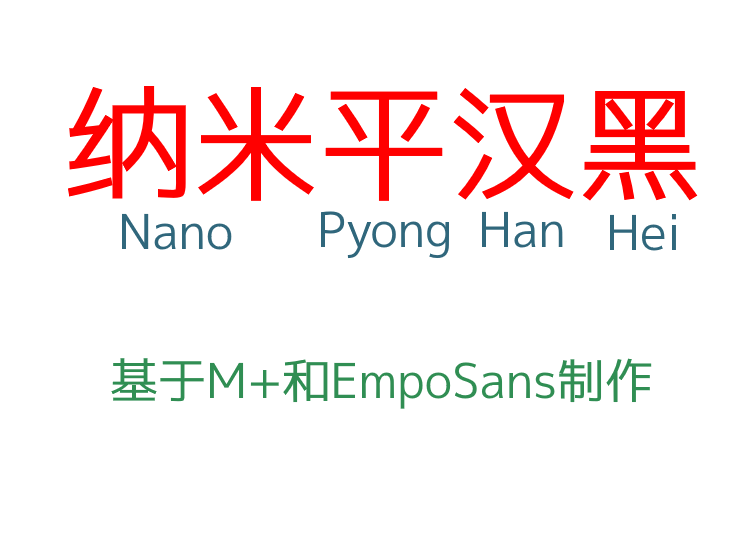
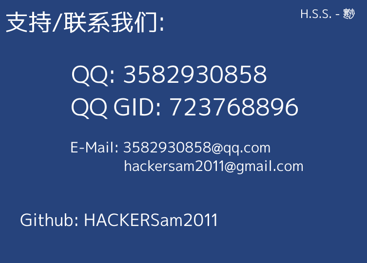

# 纳米平汉宋(NanoPyongHanHei) [更新]
### 作者：HACKERSam（H.S.S. - 寒沙）    |    邮箱:3582930858@qq.com

## 简介

这是一款基于M+字体和EmpoSans制作的黑体补充项目，现已支持常用简体和繁体，将一些M+的字改为G源，再进行简体补充，且修复了EmpoSans的大多数bug（例如：字形粗细不一）

## 概览

## 注意

### 字体制作有可能有一些误差，字符有可能会错误或制作不精良！

### 如有**字形优化**和**字形建议**的话请在[Issues #1](https://github.com/HACKERSam2011/NanoPyongHanHei/issues/1)反馈; 若是想**增加字形**的话请在[Issues #2](https://github.com/HACKERSam2011/NanoPyongHanHei/issues/2)请求！

> [!WARNING]
>
> 作者因为**学业原因**导致字体制作速度很慢，如果想为我们做出贡献或帮助，请加入我们！（请别在某些地方说我bug都不改、进度慢这些言论，我也没办法，因为学业在手啊！）

## 制作人员名单

|专项|名称|联系方式|
|-|-|-|
|制作人员|**HACKERSam**|3582930858@qq.com|
|赞助者|敬请期待|敬请期待|

## 版权

本字体基于 SIL Open Font License 修改，字体本身可开源，不得发售

## 加入我们

您可以加入QQ群：**723768896**，来与我们一起讨论、交流（此群为NANOFONT纳米字库交流群）

## 备注
上一次更新：2024/9/16
